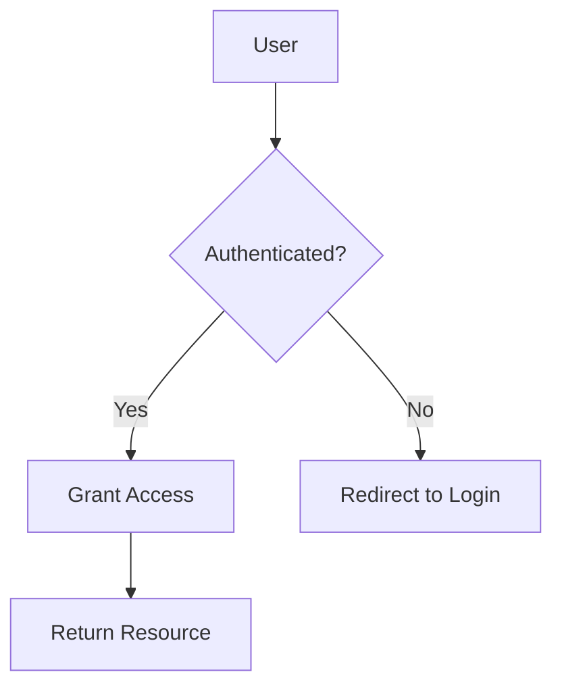

# Crystal Clear Docs

Create technical documents people actually read and understand — by layering
information from TL;DR to deep dive and explaining hard concepts with diagrams.

## Core Philosophy

1. **Lead with the answer.** The reader's first question is "does this matter to
   me?" — answer it in the first sentence. Everything else supports that answer.
2. **Layer, don't dump.** Progressive disclosure: TL;DR → Example → Explanation
   → Deep Dive. Each layer is complete and accurate on its own.
3. **Show, don't just tell.** Concepts that require the reader to hold multiple
   relationships in their head get a diagram. Code gets shown before explanation.
4. **Every word earns its place.** If removing a word changes nothing, remove it.
   Active voice. Plain language. Short sentences. Scannable structure.
5. **Respect the reader's time.** They scan, they don't read. Design for scanning:
   information-dense headings, bold key terms, lists over walls of text, and
   callouts that surface what matters.

## Quick-Start: Document Anatomy

Every crystal-clear document follows this skeleton:

```
# [Action-oriented title]
**TL;DR**: [One sentence — what and why]
[Quick-start code/command — the answer]

## Overview
[Layer 1: explanation in plain language, 2-3 paragraphs]

## How It Works
[Layer 2: mechanism, diagram if helpful, comparisons]

## Configuration / Options
[Reference table for parameters, options, choices]

## Advanced Usage
[Layer 3: edge cases, alternatives, deep architecture]

## Related
[Links to next logical step, tangential topics, support]
```

→ See `references/layered-writing.md` for the full framework.
→ See `references/document-structure.md` for formatting patterns.
→ See `references/writing-clarity.md` for word/sentence-level techniques.
→ See `references/svg-diagrams.md` for when and how to use diagrams.

## Common Problems

### "This document is a wall of text"

1. Add a one-sentence TL;DR at the very top
2. Break paragraphs into lists (3+ related items → bullet list)
3. Add descriptive H2/H3 headings (not "Overview", "Details")
4. Insert a diagram for any concept spanning more than 2 paragraphs
5. Move advanced configuration into `<details>` expandable sections

### "I don't know where to add a diagram"

Ask: does the reader need to hold 3+ relationships in their head? If yes, add a
diagram. Use Mermaid for flowcharts, sequences, state machines, ER diagrams.
Use hand-coded SVG for simple before/after or architecture comparisons.

### "The explanation is too complex"

1. Write the one-sentence version first (the Compression Ladder exercise)
2. Then the one-paragraph version
3. Then the full explanation
4. Present them in that order — readers self-select depth

### "How do I make this scannable?"

Scan this checklist:
- Headings are specific and information-dense
- Bold used only for key terms (not whole sentences)
- Lists used for any 3+ related items
- Callouts highlight warnings, tips, and gotchas
- Code blocks have language annotations and captions
- Tables used for configuration references and comparisons

## Decision Trees

### Which Diagram Type?

| Concept | Diagram | Syntax |
|---------|---------|--------|
| Step-by-step process | Flowchart | `flowchart TD` |
| Component interactions | Sequence diagram | `sequenceDiagram` |
| State lifecycle | State diagram | `stateDiagram-v2` |
| System architecture | Architecture diagram | `architecture-beta` |
| Data relationships | ER diagram | `erDiagram` |
| Timeline / roadmap | Gantt chart | `gantt` |
| A vs B comparison | Side-by-side SVG | Hand-coded or draw.io |
| Hierarchy / tree | Flowchart with subgraphs | `flowchart TD; subgraph` |

### Which Callout Type?

| Situation | Callout |
|-----------|---------|
| Supplementary context | ℹ Note |
| Better way to do it | 💡 Tip |
| Potential pitfall | ⚠ Warning |
| Data loss, security risk | 🚫 Danger |
| Worked example | Example |

### How Deep to Go?

| Reader wants... | Give them... |
|----------------|-------------|
| "Is this relevant?" | TL;DR (1 sentence) |
| "How do I use it?" | TL;DR + Code example |
| "Why does it work this way?" | + How It Works section |
| "What are the edge cases?" | + Advanced Usage section |
| "I need to contribute/modify" | + Architecture + Deep dive |

## SVGs for Visual Explanation

When a concept spans more than 2 paragraphs and involves relationships,
structure, flow, or state — add a diagram.

**Use Mermaid inline** (works on GitHub, GitLab, Notion, most Markdown renderers):



**Use inline SVGs** for precise control, annotations, and dark mode support:

```svg
<svg role="img" aria-label="..." viewBox="0 0 400 200">
  <title>Short description</title>
  <desc>Longer description for accessibility</desc>
  <!-- diagram elements -->
</svg>
```

→ Every SVG needs `role="img"`, `<title>`, and `<desc>` elements.
→ Use `currentColor` so diagrams adapt to light/dark themes.
→ Color-blind safe: never rely on color alone — always add labels.

## Quality Gate

Before publishing any document, verify:

1. **Can someone get the gist from the TL;DR alone?** If no, rewrite it.
2. **Can they self-select their depth?** Can they stop at the code example and leave satisfied?
3. **Do headings predict their content?** No "Overview", "Details" — be specific.
4. **Is every code block copy-paste runnable?** If it needs invisible setup, add it.
5. **Are diagrams needed?** Any concept 2+ paragraphs with relationships → add a diagram.
6. **Did you remove needless words?** Read each sentence. Delete every word. Re-add only what's essential.

## Reference Files

| File | Contents |
|------|----------|
| `references/layered-writing.md` | Inverted pyramid, Layer Cake Method, progressive disclosure, TL;DR patterns, code-first writing, Up-Goer Five technique |
| `references/svg-diagrams.md` | Diagram type selection, Mermaid syntax and styling, SVG accessibility, dark mode, Tufte's visualization principles, visual explanation patterns |
| `references/document-structure.md` | Document anatomy, heading hierarchies, callout/admonition patterns, comparison design, scannability, CRAP principles, responsive layout, cognitive load management |
| `references/writing-clarity.md` | Active voice, jargon elimination, sentence construction, comparison patterns, worked examples, MECE framework, BLUF method |
