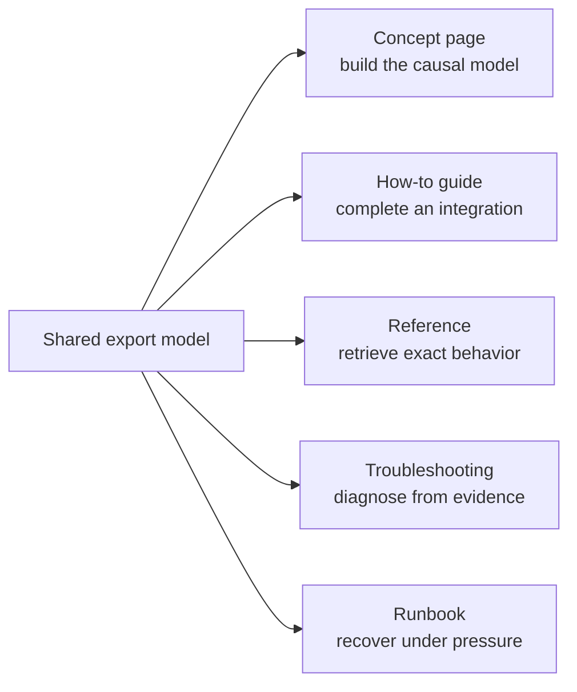

# Async Export Documentation

This fictional documentation set demonstrates what `@tank/crystal-clear-docs`
can produce. It does not collapse every audience and task into one long page.
It gives each reader job a focused file while preserving one shared system
model.

The example addresses a recurring misconception:

> `202 Accepted` means the export file is ready.

The correct model separates request acceptance, background processing, durable
completion, and completion-notification delivery.

## Choose Your Path

| If you need to | Start here |
| --- | --- |
| Understand why `202` is not completion | [How Async Exports Work](concepts/how-async-exports-work.md) |
| Add exports to an application | [Integrate Async Exports](guides/integrate-async-exports.md) |
| Look up states, guarantees, or retry ownership | [Export Lifecycle Reference](reference/export-lifecycle.md) |
| Diagnose a stuck or confusing export | [Troubleshoot Exports](troubleshooting/troubleshoot-exports.md) |
| Recover paused export processing | [Recover Export Processing](runbooks/recover-export-processing.md) |
| See how the documentation was designed and can be tested | [Reader Outcomes and Validation Plan](validation/reader-outcomes.md) |

## One Model, Multiple Document Jobs

The files repeat only the governing safety and correctness rules readers need
at the point of use. Exact state definitions and guarantees remain canonical in
the reference page.

## Layer Map

| Layer | Reader question | File responsibility |
| --- | --- | --- |
| Orientation | Where should I go? | Route readers without making them read everything |
| Mental model | Why does the system behave this way? | Explain boundaries, ownership, and causal relationships |
| Task | How do I accomplish my goal? | Provide actions, decisions, success checks, and recovery |
| Lookup | What exactly does this field or state mean? | Provide stable, exhaustive definitions |
| Diagnosis | What evidence explains this symptom? | Connect observations to likely causes and next tests |
| Operations | How do I recover safely under pressure? | State authority, hazards, gates, stop conditions, and verification |
| Validation | How do we know the docs worked? | Define observable reader outcomes and transfer tests |

## Shared Invariants

Every file preserves these truths:

1. `202 Accepted` confirms durable acceptance, not file completion.
2. `completed` becomes authoritative only after the file is stored and terminal
   state is durably recorded.
3. Processing retries may repeat generation work.
4. Webhook retries repeat notification delivery, not generation.
5. A terminal export never returns to a nonterminal state.
6. Only a worker holding the current lease token can commit attempt results.
7. Each attempt writes an immutable object keyed by its lease token; completion
   references only the current attempt's object.

## What This Example Demonstrates

- Outcome-first documentation design
- A reader misconception replaced with a causal model
- Progressive disclosure across files instead of one expanding page
- Fast paths for experienced readers and explanatory paths for newcomers
- Mermaid diagrams used for relationships that prose alone hides
- Text equivalents for complex diagrams
- Procedures with observable success and recovery states
- A safety-critical runbook separated from ordinary integration guidance
- A reader-validation plan based on prediction, execution, diagnosis, and transfer

All endpoints, payloads, limits, and operational commands are fictional. They
exist to demonstrate document architecture and explanation quality.
