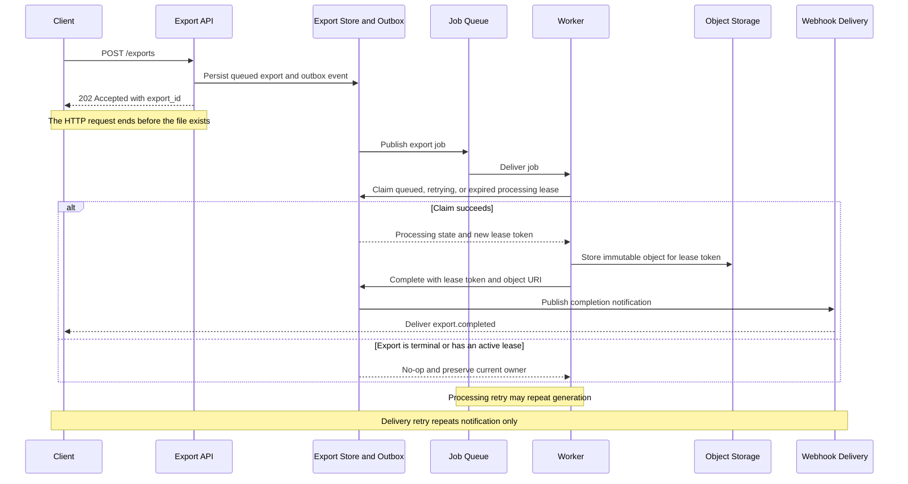

# How Async Exports Work

An async export separates accepting a request from producing its file.

`202 Accepted` means the service durably recorded the export request. The file
usually does not exist yet.

## The Four Boundaries

| Boundary | What becomes true |
| --- | --- |
| Acceptance | The export has an ID, a `queued` state, and a durable publication intent |
| Processing | A worker owns a nonterminal attempt and is generating the file |
| Completion | The file is stored and the export state is durably `completed` |
| Delivery | The client receives a webhook describing the terminal outcome |

These boundaries are deliberately separate. A completion webhook may arrive
late even when the file is ready. A fast webhook cannot make an unfinished
export complete.

## Request and Processing Timeline



### Text Equivalent

1. The API atomically creates a `queued` export and an outbox event.
2. The API returns `202 Accepted` with the export ID.
3. The outbox eventually publishes the job to the queue.
4. A worker claims `queued`, `retrying`, or `processing` with an expired lease.
   The claim creates a new lease token that fences the previous owner.
5. The worker stores an immutable object under an attempt-specific key derived
   from its lease token. A stale worker can create only an unreferenced object;
   it cannot overwrite the current attempt's file.
6. Only the worker holding the current lease token can atomically record
   `completed`, the matching object URI, and a completion-notification event.
7. Webhook delivery reports the terminal state independently.
8. Redelivery becomes a no-op for a terminal export or an active processing
   lease.

## Replace the Common Mental Model

The familiar synchronous model is:

```text
request -> work finishes -> success response
```

The export model is:

```text
request -> durable acceptance -> 202 response
                              -> processing -> terminal outcome
                                            -> notification delivery
```

The status code alone cannot answer whether the file exists. Check the export's
terminal state.

## What Each Signal Proves

| Signal | What it proves | What it does not prove |
| --- | --- | --- |
| `202 Accepted` | The request was durably accepted | A worker started or a file exists |
| `queued` | The export awaits processing | A worker has claimed it |
| `processing` | A worker owns an attempt | The attempt will succeed |
| `completed` | The file and terminal state are durable | The webhook reached the client |
| `failed` | Processing reached a terminal failure | Every notification attempt failed |

## Apply the Model to Changed Cases

### The webhook is late

If status is `completed`, the file is ready even when webhook delivery is
retrying. Polling can retrieve the authoritative state.

### The worker times out after upload

A retry may repeat work. Each attempt writes an immutable object keyed by its
lease token. The lease-guarded completion transition exposes only the current
attempt's object; unreferenced stale-attempt objects are removed later.

### Webhooks are replaced with polling

Acceptance, processing, and completion do not change. Only the delivery
mechanism changes. This is evidence that the model transfers beyond one API
shape.

## Next Steps

- Follow [Integrate Async Exports](../guides/integrate-async-exports.md) to build a client.
- Use [Export Lifecycle Reference](../reference/export-lifecycle.md) for exact states and guarantees.
- Open [Troubleshoot Exports](../troubleshooting/troubleshoot-exports.md) when observed behavior differs.
