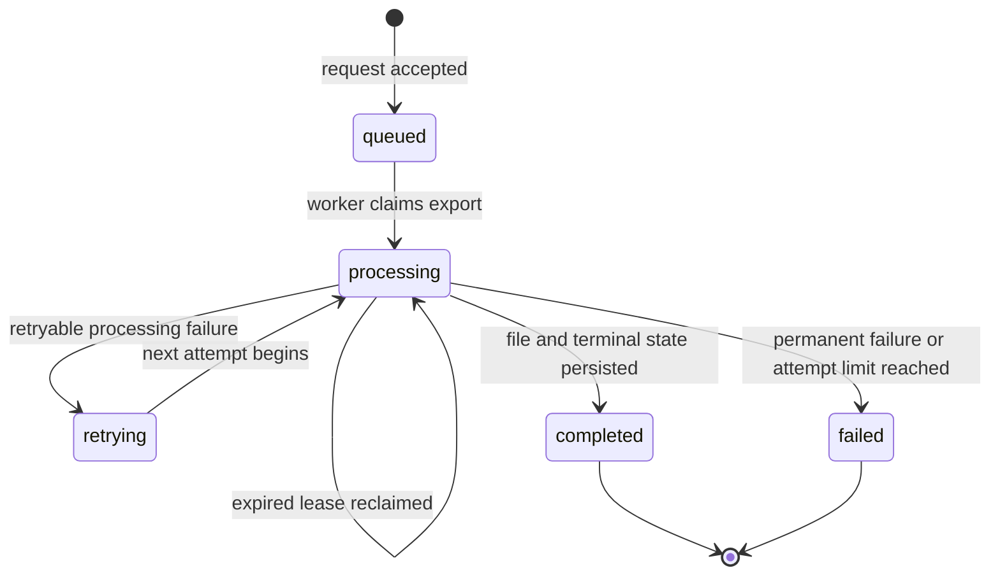

# Export Lifecycle Reference

Use this page to retrieve exact export states, transition rules, delivery
semantics, and retry ownership. For explanation, read
[How Async Exports Work](../concepts/how-async-exports-work.md).

## State Model



### Text Equivalent

- New exports begin in `queued`.
- A successful worker claim moves an export to `processing` with a lease token.
- Retryable failures move it to `retrying`; another claim returns it to
  `processing`.
- An expired `processing` lease may be reclaimed with a new token that fences
  the previous worker.
- Successful storage and terminal-state persistence move it to `completed`.
- A lease-holding worker moves `processing` to `failed` when the current failure
  is permanent or exhausts the attempt limit.
- `completed` and `failed` are terminal. Redelivered jobs cannot change them.

## State Definitions

| State | Meaning | File available | Terminal |
| --- | --- | --- | --- |
| `queued` | Durably accepted and awaiting worker ownership | No | No |
| `processing` | A worker with the current lease token owns the attempt | No | No |
| `retrying` | A retryable attempt failed and another may run | No | No |
| `completed` | File stored and terminal state committed | Yes | Yes |
| `failed` | Processing ended without a completed file | No | Yes |

## Allowed Transitions

| From | To | Owner | Required condition |
| --- | --- | --- | --- |
| New | `queued` | API | Export and outbox event commit atomically |
| `queued` | `processing` | Worker | Conditional claim creates a lease token |
| `processing` | `retrying` | Worker | Failure is retryable and attempts remain |
| `retrying` | `processing` | Worker | Conditional claim creates a lease token |
| `processing` | `processing` | Worker | Existing lease expired; new token fences prior owner |
| `processing` | `completed` | Worker | Current lease token matches; matching immutable object exists; completion, object URI, and notification intent commit atomically |
| `processing` | `failed` | Worker | Current lease token matches; failure is permanent or exhausts the attempt limit |

Any attempted transition from `completed` or `failed` is a no-op.

## API Guarantees

| Surface | Guarantee |
| --- | --- |
| `POST /v1/exports` | Returns `202` after `queued` state and publication intent commit |
| Status API | Returns the authoritative durable export state |
| Queue delivery | At least once |
| Worker execution | May repeat after a retry or expired lease |
| Attempt writes | Accepted only from the current lease token |
| Object storage | Immutable attempt object keyed by export ID and lease token |
| Completion transition | Lease-guarded; references only the current attempt object |
| Webhook delivery | At least once |
| Webhook ordering | Not guaranteed across different exports |
| Download URL | Available only for `completed`; short lived |

## Retry Ownership

| Failure | Retry owner | Repeated operation | Does export leave a terminal state? |
| --- | --- | --- | --- |
| Outbox publication fails | Outbox publisher | Publish queue message | No |
| Generation fails transiently | Queue and worker | Claim and generate | No |
| Storage fails transiently | Queue and worker | Write a new immutable attempt object | No |
| Completion webhook fails | Webhook delivery | Deliver notification | No |
| Client request times out | Client with same idempotency key | Reconcile or resubmit request | No duplicate export expected |

## Example Payload

```json
{
  "id": "exp_01JABC123",
  "status": "completed",
  "created_at": "2026-08-15T19:30:00Z",
  "completed_at": "2026-08-15T19:33:58Z",
  "attempt": 2,
  "download_url": "https://downloads.example.test/example-signed-url",
  "download_expires_at": "2026-08-15T20:33:58Z",
  "error": null
}
```

## Related Tasks

- [Integrate Async Exports](../guides/integrate-async-exports.md)
- [Troubleshoot Exports](../troubleshooting/troubleshoot-exports.md)
- [Recover Export Processing](../runbooks/recover-export-processing.md)
