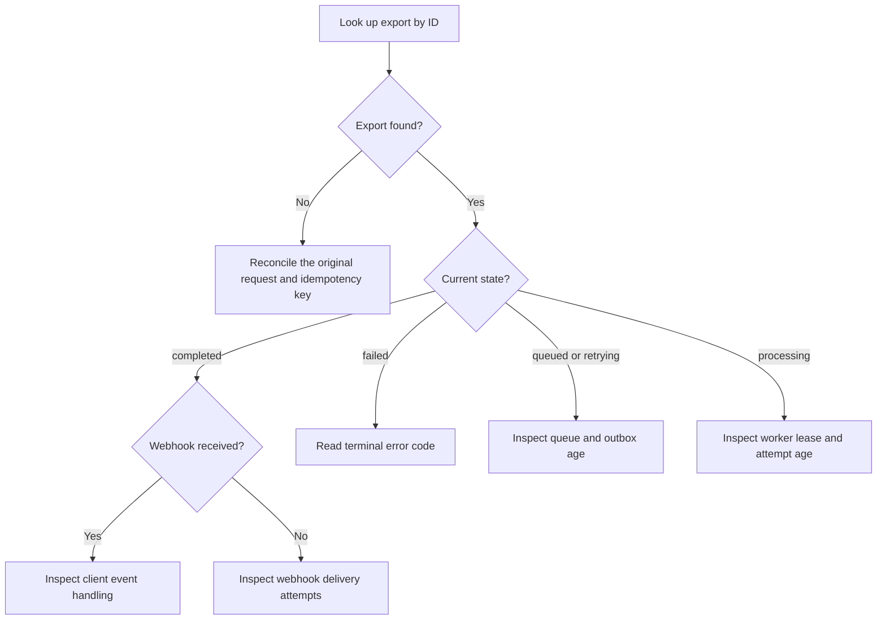

# Troubleshoot Exports

Start from the observed symptom. Do not infer export state from webhook delivery
alone.

## Diagnostic Path

### Text Equivalent

1. Look up the export by ID.
2. If it does not exist, reconcile the original request and idempotency key.
3. If it is `completed`, investigate webhook delivery or client handling rather
   than rerunning generation.
4. If it is `failed`, use the terminal error code.
5. If it is `queued` or `retrying`, inspect publication, queue age, and capacity.
6. If it is `processing`, inspect the worker lease and attempt age.

## Webhook Missing

**Symptom:** The status API returns `completed`, but the client did not receive
`export.completed`.

**What this proves:** Generation succeeded. The failure is in notification
delivery or client handling.

Check:

1. Search delivery attempts by export ID.
2. Confirm the destination URL and signing-key version.
3. Inspect the latest HTTP status and response body.
4. Confirm the client deduplication store did not accept and hide the event.
5. Replay notification delivery only when policy permits.

Do not regenerate the export. The file and terminal state already exist.

## Export Stuck

**Symptom:** The export remains `queued`, `processing`, or `retrying` longer than
the service objective.

| State | Inspect first | Likely ownership |
| --- | --- | --- |
| `queued` | Outbox age, queue depth, publisher health | Publication or queue capacity |
| `processing` | Worker lease, heartbeat, attempt start | Current worker |
| `retrying` | Last error, next attempt time, attempt count | Retry policy or dependency |

Do not manually force `completed`. Completion requires a stored file and an
atomic terminal transition.

Escalate to the recovery runbook when queue consumption is paused or worker
leases are no longer progressing.

## Duplicate Completion Handling

**Symptom:** The client processed the same completion more than once.

Confirm:

- Webhook delivery is at least once.
- The client stores `event_id` under a unique constraint.
- Deduplication and the local state update commit in one transaction.
- A successful duplicate returns a success response without repeating effects.

Do not ask the delivery system to provide exactly-once behavior across the
network. Make client effects idempotent.

## Export Failed

**Symptom:** State is `failed`.

1. Read the terminal error code and attempt count.
2. Determine whether inputs changed since submission.
3. Correct invalid input before creating another export.
4. For an infrastructure failure, preserve the failed export for audit and
   create a new export with a new idempotency key after recovery.

## Related Pages

- [Export Lifecycle Reference](../reference/export-lifecycle.md)
- [Recover Export Processing](../runbooks/recover-export-processing.md)
