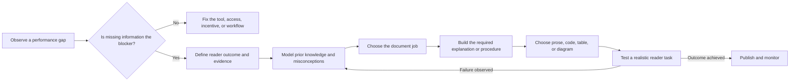

# Crystal Clear Docs: Documentation That Changes What Readers Can Do

`@tank/crystal-clear-docs` is not primarily a formatting or copyediting skill.
It designs documentation backward from a change in reader performance.

Use it when a reader must do more than encounter accurate words: find the
right fact, execute safely, explain a mechanism, diagnose a failure, choose
between options, or transfer an idea to a changed situation.

## The Central Idea

Generic writing advice often begins with the draft:

> How can we make this shorter, cleaner, and easier to scan?

Crystal Clear Docs begins one step earlier:

> What must the reader be able to do, what currently prevents that, and what
> evidence would show that the document helped?

Clear prose still matters, but it is downstream of the reader's task. A page
can be concise, attractive, and easy to scan while leaving the reader with the
wrong mental model.

## Choose Your Path

- **Need the exact workflow?** Use the [Quick Reference](#quick-reference).
- **Using the skill for the first time?** Continue through the worked export
  example from [Step 1](#step-1-diagnose-before-writing).
- **Evaluating whether a document worked?** Go to
  [Validate the Intended Outcome](#step-8-validate-the-intended-outcome).

## Quick Reference

| Decision | Question | Output |
| --- | --- | --- |
| Diagnose | Is missing or misunderstood information the blocker? | Documentation or a different intervention |
| Define | What must the reader do, and what would prove it? | Observable outcome and evidence |
| Model | What prior knowledge or misconception shapes interpretation? | Reader model and prerequisite plan |
| Select | Which document job matches the reader's immediate need? | Reference, how-to, tutorial, concept, decision guide, troubleshooting guide, or runbook |
| Explain | Which relationships and decisions must become visible? | Causal model, procedure, examples, contrasts, and boundaries |
| Represent | Which medium exposes those relationships efficiently? | Prose, code, table, diagram, or a complementary combination |
| Validate | Can representative readers perform a realistic task? | Observed failures and revision evidence |

## The Workflow



The loop matters. The first draft expresses the author's model. Reader testing
reveals where that model was not successfully reconstructed or applied.

## Step 1: Diagnose Before Writing

Documentation helps when unavailable, misunderstood, or poorly organized
information causes the problem. It cannot repair every performance gap.

| Observed problem | Likely intervention |
| --- | --- |
| Engineers cannot find the retry limit | Reference documentation |
| Engineers misunderstand what a retry repeats | Conceptual explanation plus examples |
| Engineers know the command but lack permission | Access or workflow change |
| A dangerous command has no confirmation | Product or tooling change |
| Operators forget a rare emergency sequence | Runbook at the point of work |
| Teams disagree because policy is ambiguous | Policy decision before documentation |

Writing another guide for a permissions failure creates more text without
changing the outcome. The skill explicitly permits "documentation is not the
right intervention" as the correct diagnosis.

## Step 2: Define Observable Reader Performance

Replace vague goals such as "understand exports" with a performance statement:

> Given a `202 Accepted` response and an export status, an API integrator can
> identify whether a file exists, choose the correct completion signal, and
> explain which subsystem owns each retry.

Then define matching evidence:

- The reader does not treat `202 Accepted` as completion.
- The reader uses terminal export state or the status API to detect completion.
- The reader separates worker retries from webhook-delivery retries.
- The reader applies the same model when a queue or webhook fails.

The evidence determines what the page must teach. It also prevents a polished
overview from being mistaken for a successful explanation.

## Step 3: Model the Reader

Suppose the audience already knows HTTP request-response APIs but assumes a
successful response means the requested work is finished.

That assumption is not an empty knowledge gap. It is a competing mental model:

```text
Existing model: request -> work completes -> success response

Required model: request -> work accepted -> success response
                         -> background processing -> terminal outcome
```

The document must expose the difference. Merely defining "asynchronous" may
add vocabulary without replacing the old causal structure.

For this audience, preserve familiar HTTP concepts and introduce only the new
boundaries:

- **Acceptance boundary:** the API has recorded the request.
- **Processing boundary:** a worker owns file generation.
- **Completion boundary:** the file has reached durable storage.
- **Delivery boundary:** a separate subsystem reports the outcome.

## Step 4: Choose the Document Job

One page should not silently combine incompatible reader jobs.

| Reader question | Document job | Useful structure |
| --- | --- | --- |
| What does `202` mean here? | Concept page | Causal model, timeline, contrast |
| How do I integrate exports? | How-to | Ordered actions, checks, recovery |
| What are the exact retry limits? | Reference | Stable table, exhaustive values |
| Why did this export fail? | Troubleshooting | Symptoms, evidence, causes, remedies |
| How do we recover the service? | Runbook | Authority, hazards, gates, stop conditions |

The export documentation set may contain all five forms. The important choice
is not to make one page behave like all five at once.

## Step 5: Build the Explanation

For the misconception about `202`, begin with the governing distinction:

> `202 Accepted` confirms acceptance, not completion. The HTTP request ends
> while export processing continues.

Then make the causal model visible:

1. The client sends `POST /exports`.
2. The API validates the request and records a job.
3. The API returns `202 Accepted` with an export ID.
4. A worker later generates and stores the file.
5. The export enters `completed` or `failed`.
6. Webhook delivery reports that terminal state independently.

Add a contrast that targets the old model:

| Signal | What it proves | What it does not prove |
| --- | --- | --- |
| `202 Accepted` | The API accepted the request | The worker ran or a file exists |
| `processing` | A worker is attempting the export | The attempt will succeed |
| `completed` | The file was generated and stored | The webhook was delivered |
| `failed` | Processing ended without a file | Every webhook attempt failed |

The final column matters because it blocks the likely incorrect inference.

## Step 6: Show Retry Ownership

Use a diagram when spatially separating boundaries reduces explanation cost.

**Diagram purpose:** Show where the HTTP request ends, when terminal export
state becomes authoritative, and why processing retries differ from webhook
delivery retries.

```mermaid
sequenceDiagram
    participant C as Client
    participant A as Export API
    participant J as Export Store + Outbox
    participant Q as Job Queue
    participant W as Worker
    participant S as Object Storage
    participant H as Webhook Delivery

    C->>A: POST /exports
    A->>J: Persist queued export + outbox event
    A-->>C: 202 Accepted + export_id
    Note over C,A: HTTP request ends; file may not exist

    J->>Q: Publish export job
    Q->>W: Deliver job
    W->>J: Claim only if status is nonterminal
    alt Claim succeeds
        J-->>W: Persist and return processing
        W->>S: Store generated file
        W->>J: Persist completed + notification event
        J->>H: Publish completion notification
        H-->>C: Deliver completion webhook
    else Export already completed or failed
        J-->>W: No-op; preserve terminal state
    end

    Note over Q,W: Processing retries repeat job execution
    Note over H,C: Delivery retries repeat notification only
```

The surrounding prose and the diagram perform different jobs. The prose states
the guarantee; the diagram makes timing, ownership, and separation visible.

### Text Equivalent

1. The client submits an export request to the API.
2. In one durable transaction, the API creates the export with status `queued`
   and records an outbox event for queue publication.
3. The API returns `202 Accepted` with an export ID. The HTTP request ends
   before the file necessarily exists.
4. The outbox publishes the job to the queue. This makes queue publication
   recoverable if the API process stops after returning the response.
5. The queue delivers the job to a worker. The worker conditionally claims only
   a nonterminal export and persists `processing`. A redelivery for an export
   already marked `completed` or `failed` becomes a no-op, so it cannot regress
   terminal state. A retry of a nonterminal attempt can repeat processing, so
   generation and storage must also be idempotent for the export ID.
6. The worker stores the generated file in object storage.
7. After storage succeeds, the worker atomically persists `completed` and a
   notification event in the export store. The durable terminal state is
   authoritative for status queries.
8. The outbox publishes the completion event to webhook delivery.
9. A webhook retry repeats notification delivery only. It does not regenerate
   the file or move the export out of `completed`.

## Step 7: Support Novices and Experts Without Two Truths

An expert may need only the state table and retry-policy reference. A novice
may need the causal timeline, worked example, and explanation of idempotency.

Provide different entry paths into one factual model:

- Put the governing rule and exact state table early.
- Make prerequisites and the worked explanation easy to enter or skip.
- Link exact limits and payload fields to maintained reference material.
- Keep hazards and correctness conditions visible on every path.

Do not create a simplified beginner explanation that becomes false at the first
edge case.

## Step 8: Validate the Intended Outcome

Do not ask, "Was this clear?" That question measures confidence and politeness
more readily than performance.

Give representative readers changed cases:

### Case A: Delayed Webhook

The export status is `completed`, but no webhook arrived. Did generation fail?

**Evidence of the target model:** The reader says no. The file can be complete
while webhook delivery is delayed or retrying.

### Case B: Worker Retry

The worker times out while uploading, and the queue retries the job. What must
be idempotent?

**Evidence of the target model:** The reader identifies file generation and
storage for the same export ID, not only webhook handling.

### Case C: Changed Transport

The system replaces webhooks with polling. Which boundaries remain?

**Evidence of transfer:** Acceptance, processing, and completion remain. Only
the delivery mechanism changes.

Observe wrong predictions, hesitation, external searches, and skipped safety
conditions. Revise the model, examples, navigation, or product where the
failure originates.

## What Makes This Different

| Broad writing skill | Crystal Clear Docs |
| --- | --- |
| Starts with the draft | Starts with the performance gap |
| Optimizes readability | Aligns content with observable reader outcomes |
| Assumes missing information | Diagnoses knowledge, access, motivation, tool, and workflow causes |
| Simplifies vocabulary | Repairs prior knowledge and competing mental models |
| Uses one generic page structure | Chooses reference, how-to, tutorial, concept, decision guide, troubleshooting guide, or runbook |
| Adds diagrams for visual variety | Selects representations by cognitive job |
| Reviews for polish | Tests realistic lookup, execution, prediction, diagnosis, and transfer |

## Use the Skill When

- A technically accurate page still produces repeated mistakes.
- Readers can copy an example but cannot adapt it.
- Beginners are lost while experts cannot find exact facts.
- A procedure hides decisions, hazards, verification, or recovery.
- A diagram looks polished but leaves boundaries ambiguous.
- A team needs evidence that documentation changed reader performance.

For a small grammar correction or typo, edit directly. Use the full workflow
when misunderstanding, unsafe action, poor decisions, or failed transfer are
the real risks.
