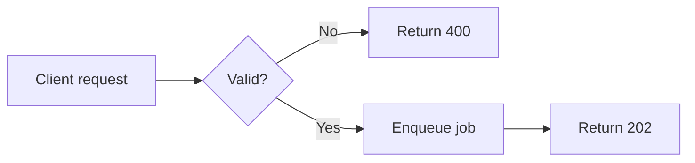

# Visual and Multimedia Explanation

Sources: Richard E. Mayer (Multimedia Learning), Dunlosky and Rawson (The Cambridge Handbook of Cognition and Education), Edward Tufte (Envisioning Information; The Visual Display of Quantitative Information), W3C Web Accessibility Initiative guidance, and Mermaid documentation.

Covers: Design visual and multimedia explanations with selecting-organizing-integrating principles; manage dual channels and limited capacity; select, integrate, implement, accessibly describe, and visually validate Mermaid and SVG diagrams for different audiences.

## Design for Active Processing

Treat a visual explanation as support for three learner activities:

1. Select relevant words and visual elements.
2. Organize selected material into coherent verbal and pictorial models.
3. Integrate those models with each other and with prior knowledge.

Do not add a diagram merely to decorate prose.
Give the visual a cognitive job that the reader can state.

Define the job as an observable interpretation, trace, comparison, prediction, or decision.
Engagement can support attention and effort, but it is not evidence of understanding. Keep an engaging visual when it supports motivation without competing with the explanatory goal; otherwise remove or redesign it.

## Respect Dual Channels and Limited Capacity

People receive material through the eyes and ears, then process selected material in limited-capacity visual/pictorial and auditory/verbal working-memory channels. Printed words enter visually before the learner represents them verbally, so sensory route and representational mode are related but not identical.
Meaningful learning requires active selection, organization, and integration.

Apply these implications:

- Use words and visuals when they contribute complementary information.
- Reduce simultaneous elements that compete for the same channel.
- Group material into meaningful units.
- Pace dynamic explanations so readers can complete one integration before the next.
- Reuse visual conventions so readers spend less capacity decoding notation.
- Make the relationship between representations explicit.

Do not interpret dual channels as permission to duplicate every sentence as narration, labels, and captions.
Duplication can overload rather than reinforce.

## Select the Representation from the Relationship

Choose a representation based on what the reader must perceive or infer.

| Explanatory need | Useful representation | Reader action |
| --- | --- | --- |
| Ordered actions with branching | Flowchart or decision tree | Follow a path and evaluate conditions |
| Messages among actors over time | Sequence diagram | Trace order, ownership, and response |
| Valid states and transitions | State diagram | Predict legal and illegal transitions |
| Components and boundaries | Architecture or containment diagram | Locate responsibility and dependency |
| Data entities and cardinality | Entity-relationship diagram | Infer allowed associations |
| Causal mechanism | Causal chain or process model | Explain how a change produces an effect |
| Comparison under common dimensions | Aligned small multiples or table | Detect similarities and differences |
| Quantitative magnitude | Position or length encoding | Compare values accurately |
| Trend over time | Line chart | Detect direction, rate, and exceptions |
| Distribution | Histogram, dot plot, or box plot | Inspect spread, clusters, and outliers |
| Spatial arrangement | Map or spatial schematic | Relate location to behavior |
| Exact values | Table | Retrieve precise entries |

Use prose when sequence, space, quantity, or relationship is not central.
Use code when the exact executable form is the target.
Use a table when readers need systematic comparison or precise lookup.

Do not default to a flowchart for every concept.
A poor representation can make the relevant relationship harder to see.

## Apply Coherence Selectively

Exclude material that does not support the explanatory goal.

Remove decorative illustrations, unrelated icons, background textures, gratuitous animation, ornamental frames, and labels that repeat obvious shapes.
Retain context that prevents a false inference or supports orientation.

Do not reduce coherence to visual minimalism.
A sparse diagram can still be incoherent if it omits the relationship the reader needs.

## Signal Structure and Attention

Guide attention toward organization and consequential changes.

Use signaling through:

- Descriptive titles that state the diagram's claim or question.
- Consistent shape semantics.
- Typographic hierarchy.
- Direct labels.
- Numbered phases.
- Selective emphasis.
- Boundary boxes.
- Aligned lanes.
- Highlighted paths tied to the current explanation.

Maintain a restrained visual vocabulary.
Use one emphasis treatment for the same semantic purpose.

Do not signal everything.
When every node is bold, colored, or boxed, nothing receives priority.

## Keep Related Words and Visuals Contiguous

Place explanatory words near the corresponding visual element in space and time.

For static visuals:

- Put short labels on or beside the relevant object.
- Position captions immediately before or after the visual.
- Align callouts with the element they explain.
- Avoid legends when direct labels remain legible.
- Keep a code excerpt near the diagram state it implements.

Avoid forcing readers to alternate between distant prose and an unlabeled diagram.
Eye travel and memory load can prevent integration.

## Set Redundancy Boundaries

Avoid presenting identical, information-dense words simultaneously as narration and on-screen text when both compete for verbal processing.

Use on-screen text when:

- The content is a name, value, formula, command, or exact phrase.
- The reader must inspect it at their own pace.
- Audio is unavailable or undesirable.
- Accessibility requires a textual alternative.
- The audience may not understand the narration language or accent reliably.

Use narration with visuals when:

- Animation changes too quickly for extended labels.
- Spoken explanation can offload visual attention.
- The visual itself already occupies substantial visual capacity.
- Playback controls let the reader pause and replay.

Use concise labels plus narration when exact terms must remain visible.
Do not remove essential text merely to comply with a redundancy slogan.

Distinguish visible duplication from accessible alternatives.
Captions, transcripts, and descriptions remain necessary even when they repeat spoken content for users who need them.

## Segment Complex Explanations

Break a complex visual process into learner-controlled, meaningful segments.

Segment by:

- Phase of a process.
- Decision point.
- System boundary.
- Layer of abstraction.
- Actor interaction.
- Before and after state.
- Stable subproblem.

Give readers controls to advance, pause, return, or inspect.
For static documents, use a sequence of small multiples or progressive panels.

Do not animate a complete architecture diagram one arrow at a time without preserving orientation.
Keep stable landmarks visible across segments.

Split a visual when the reader must answer unrelated questions.
Keep it unified when separating it would hide a critical relationship.

## Pretrain Names, Roles, and Notation

Introduce essential components and conventions before asking readers to follow a complex interaction.

Pretrain:

- Component names.
- Shape meanings.
- Arrow semantics.
- Units and scales.
- Actor roles.
- Required domain terms.
- Color or line-style categories.

Use a compact orientation panel or an initial labeled state.
Then reuse the same names and encodings throughout.

Do not pretrain incidental details.
Teach only what reduces decoding effort during the main explanation.

## Use Modality with Context

Choose spoken or written words according to task, medium, and audience.

Prefer spoken explanation alongside a visually dense animation when the learner can control playback and hear clearly.
Prefer written explanation for searchable reference, code, formulas, unfamiliar terminology, multilingual access, noisy environments, or self-paced inspection.

Do not declare one modality universally superior.
Prototype against the actual task and delivery environment.

## Integrate Visuals with Prose

Make prose and visual perform complementary roles.

Use an integration sequence:

1. State what the reader should determine.
2. Orient the reader to the visual's entities and encoding.
3. Direct attention through the relevant relationship.
4. Explain the inference.
5. Ask the reader to use the visual on a new case.

Do not write "see diagram below" without stating what to look for.

Example:

> Trace the solid path from the client to storage. Authorization occurs after routing but before the transaction begins, so rejected requests never acquire a database connection.

This sentence coordinates attention and inference.

## Show Processing and Retry Boundaries

For asynchronous architecture, label more than components and arrows:

| Boundary | Make explicit |
| --- | --- |
| Acceptance | What acknowledgement guarantees and what remains incomplete |
| Processing | Which component owns the work and terminal state |
| Retry | Owner, repeated operation, attempt scope, backoff, and limit |
| Delivery | At-most-once or at-least-once behavior and deduplication duty |
| Failure | Retryable versus terminal failure and dead-letter or escalation path |

Keep processing retries separate from notification or delivery retries. Show whether duplicate execution is possible and where idempotency is enforced. Validate success, transient failure, retry exhaustion, duplicate delivery, and non-retryable failure as distinct traces.

## Integrate Visuals with Code

Connect conceptual structure to executable details without pretending they are identical.

Use these patterns:

- Match component names to module or function names where practical.
- Number diagram phases and code excerpts consistently.
- Highlight the path implemented by the adjacent snippet.
- State which implementation details the diagram intentionally omits.
- Link each failure path to the handling branch in code.
- Show a state transition beside the operation that triggers it.
- State what an acknowledgement proves, such as `202` meaning accepted rather than completed.

Avoid diagrams that reproduce source code as boxes and arrows.
Abstract implementation only enough to expose the target relationship.
State which implementation details were intentionally omitted.

## Account for Expertise Differences

Adjust visual support to the reader's existing schemas.

For novices:

- Pretrain notation and component roles.
- Reduce simultaneous relations.
- Use direct labels and guided paths.
- Show representative concrete cases.
- Keep explanatory support close to the visual.

For experienced readers:

- Preserve information density when it supports rapid pattern recognition.
- Remove guidance that obscures the full structure.
- Expose exceptions, tradeoffs, and implementation boundaries.
- Provide navigable overview and detail views.

Do not assume that simplified visuals always help novices or that dense visuals always help experts.
Validate whether the representation matches their knowledge and task.

Provide alternate entry points when one document serves mixed expertise:

- Orientation view for unfamiliar readers.
- Full system view for experienced readers.
- Focused detail views for specific questions.

## Design Accessible Visual Explanations

Provide equivalent access to the visual's purpose and information.

For simple informative images, write concise alternative text that communicates the relevant relationship.
For complex diagrams, provide a short alternative plus a nearby structured description or equivalent data.
For decorative images, use an empty alternative so assistive technology can skip them.

Also:

- Preserve meaningful reading order in the DOM.
- Meet contrast requirements for text and meaningful graphics.
- Do not encode meaning through color alone.
- Pair color with labels, shape, line style, or pattern.
- Keep text selectable when practical.
- Support zoom and responsive resizing.
- Avoid flashing or uncontrolled motion.
- Provide pause controls for animation.
- Caption and transcribe narrated media.

Do not assume `<title>` and `<desc>` alone explain a complex diagram adequately.
Write a nearby text explanation when relationships, sequences, or data require detail.

## Implement Maintainable Mermaid Diagrams

Use Mermaid for diagrams whose semantics fit its supported forms and whose source will change with the system.

Prefer Mermaid when:

- Text diffs matter.
- Contributors need to edit without design software.
- Automatic layout is acceptable.
- The target renderer supports the required diagram type.

Keep source semantic:



Use stable identifiers separate from visible labels.
Keep labels concise and explain details in surrounding prose.
Group related nodes only when containment carries meaning.
Choose layout direction from the relationship and available page width.

Do not depend on declaration order as a guarantee of exact placement.
Renderer versions and layout engines can change output.

Pin or record the Mermaid version used for generated artifacts.
Render diagrams in CI or documentation previews when appearance matters.

## Implement Robust SVG

Use hand-authored or tool-generated SVG when precise composition, custom illustration, interaction, or stable placement is required.

Start with a responsive root:

```svg
<svg
  xmlns="http://www.w3.org/2000/svg"
  viewBox="0 0 800 450"
  role="img"
  aria-labelledby="ccdocs-write-title ccdocs-write-description"
>
  <title id="ccdocs-write-title">Validated write path</title>
  <desc id="ccdocs-write-description">
    Requests pass from the API through validation and authorization before storage.
  </desc>
</svg>
```

Use unique IDs for every inline SVG in the document.

Implementation guidance:

- Preserve `viewBox` during optimization.
- Let CSS constrain display width and height.
- Use reusable classes or CSS custom properties for themes.
- Keep stroke widths legible at intended sizes.
- Prefer real text over outlined glyph paths when portability permits.
- Define markers and repeated symbols once in `<defs>`.
- Remove editor metadata and unused definitions.
- Sanitize externally sourced SVG before inline embedding.
- Test inline, ``, and generated-file behavior according to the chosen delivery path.

Use `currentColor` for monochrome elements that should inherit surrounding text color:

```svg
<path d="M20 40 H180" fill="none" stroke="currentColor" stroke-width="2" />
```

Use explicit semantic colors when categories must remain stable across contexts.
Test those colors in light mode, dark mode, forced colors, and grayscale.

Do not prescribe transparent or opaque backgrounds universally.
Choose deliberately based on embedding context and test both expected themes.

## Validate the Visual, Not Just the Source

Render every diagram in its actual documentation environment.
Source validity does not guarantee usable output.

Inspect at:

- Expected desktop width.
- Narrow mobile width.
- Browser zoom.
- Light and dark themes.
- High-contrast or forced-color mode where supported.
- The exported or printed format.
- The minimum intended resolution.

Verify:

| Check | Question |
| --- | --- |
| Explanatory purpose | Can readers state the intended relationship or inference? |
| Selection | Do important elements attract attention before decoration? |
| Organization | Can readers group parts and follow the intended structure? |
| Integration | Can readers connect labels, prose, and prior concepts? |
| Legibility | Are text, lines, markers, and distinctions readable at target size? |
| Semantics | Do shape, color, and line conventions remain consistent? |
| Accessibility | Is equivalent information available without vision, color, motion, or audio? |
| Responsiveness | Does resizing preserve meaning and usable text size? |
| Fidelity | Does the diagram match the current system or data? |
| Robustness | Does it render correctly in every supported renderer? |

Use representative reader tasks rather than aesthetic preference alone:

- Ask a reader to trace one path.
- Ask where a decision occurs.
- Ask what changes between two states.
- Ask for a prediction from the visual.
- Ask which element supports the stated conclusion.
- Trace success, transient failure, retry exhaustion, duplicate delivery, and terminal failure when retries are part of the system.

Record errors and hesitation.
Revise labels, grouping, segmentation, or representation according to observed failures.

## Avoid Universal Layout Rules

Treat layout principles as content-dependent tradeoffs.
Reduce crossings when they impair tracing, preserve feedback loops when they matter, split only separable questions, and choose direct labels or legends according to legibility.
Judge the result by whether the intended reader can find elements, follow relationships, make the intended inference, and explain omissions.
Do not enforce fixed node, crossing, paragraph, or font-size quotas without reference to medium and audience.

## Visual Explanation Review

Run this review before publication:

1. State the visual's cognitive job in one sentence.
2. Confirm that the chosen representation exposes the target relationship.
3. Remove unrelated material and preserve necessary context.
4. Signal the organization and consequential path.
5. Place labels and explanation close to corresponding elements.
6. Check whether simultaneous words duplicate or complement one another.
7. Segment complexity and pretrain notation where needed.
8. Align prose, visual, and code terminology.
9. Provide accessible alternatives and interaction controls.
10. Render in every supported theme, width, and output format.
11. Test a representative interpretation or prediction task.
12. Revise from observed comprehension failures, not taste alone.
