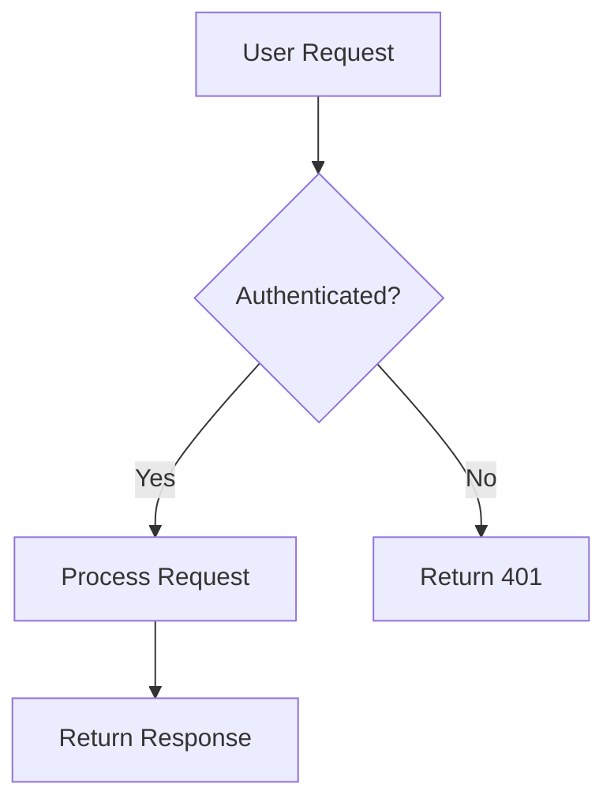
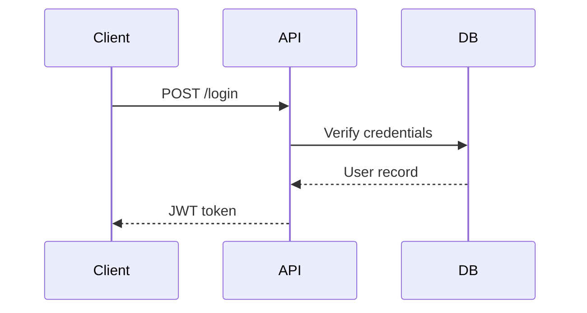
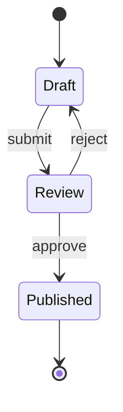
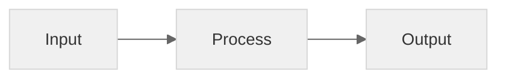
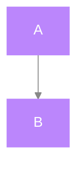

# SVG Diagrams for Technical Explanation

Sources: Edward Tufte (The Visual Display of Quantitative Information, 1983; Envisioning Information, 1990), blobstreaming.org SVG Diagrams for Docs (2024), W3C Writing Accessible SVG (draft), Google Developer Style Guide (Images section), SAP Architecture Center Diagram Best Practices, arivictor/diagram-style-guide (GitHub, 2024), Few/Tufte Design Library.

Covers: When and how to use SVG diagrams to explain concepts that are hard to understand without visual guides. Diagram type selection, SVG accessibility, dark mode compatibility, Mermaid integration, and visual explanation patterns.

## When Diagrams Help (and When They Don't)

SVG diagrams excel at explaining: architecture, data flows, state machines, process flows, relationships (ER, class hierarchies), sequences, comparisons, before/after states.

SVG is NOT the right choice for: photographs or screenshots (use JPEG/WebP), highly complex diagrams with 100+ elements (rendering performance degrades), diagrams requiring pixel-identical browser rendering.

**The test**: If you can explain it clearly in 2-3 sentences, you probably don't need a diagram. If the reader needs to hold multiple relationships in their head simultaneously, a diagram reduces cognitive load.

## Diagram Type Selection

| To Explain | Use | Example Tools |
|-----------|-----|---------------|
| How data/control flows through a system | Flowchart | Mermaid flowcharts |
| Components and their connections | Architecture diagram | Mermaid architecture-beta, Excalidraw |
| Order of operations between actors | Sequence diagram | Mermaid sequence diagram |
| Decision logic, conditions | Decision tree | Mermaid flowchart with diamonds |
| Entity relationships | ER diagram | Mermaid ER, DBML |
| States and transitions | State diagram | Mermaid state diagram |
| Comparisons (A vs B) | Side-by-side boxes, Venn | Hand-coded SVG |
| Timeline / progression | Timeline | Mermaid gantt |
| Hierarchy / tree | Tree diagram | Mermaid flowchart with subgraphs |
| Before/After | Paired annotated diagrams | Hand-coded SVG |

## Diagram-As-Code with Mermaid (Preferred Method)

Mermaid is ideal for documentation because:
- Source is readable Markdown-like text, diffs cleanly in Git
- Renders to SVG automatically
- 10x-100x smaller than GUI-generated SVGs
- Can be embedded directly in Markdown on many platforms (GitHub, GitLab, Notion)

### Essential Mermaid Diagram Types

**Flowchart** — for processes, data flows, logic:


**Sequence Diagram** — for interactions between components:


**State Diagram** — for lifecycle, status:


### Mermaid Styling for Clarity

Four knobs matter most for professional-looking diagrams:

1. **Theme**: `default`, `forest`, `dark`, `neutral`, `base`. `base` if customizing deeply.
2. **themeVariables**: Only six actually matter: `primaryColor`, `primaryTextColor`, `primaryBorderColor`, `lineColor`, `fontFamily`, `fontSize`.
3. **Edge curves**: Default `basis` curves look amateur. Switch to `linear` for pipelines, `step` for hierarchies.
4. **Layout direction**: `TD` (top-down) for hierarchies, `LR` (left-right) for pipelines.



### Declaration Order for Clean Layouts

Tier-based ordering: declare elements in the order they should appear visually, following natural data flow. Declare ALL elements before ANY relationships. Group related elements with `subgraph`.

## Visual Explanation Patterns

### 1. Annotated Architecture

Annotate directly on the diagram rather than using separate legends. Labels near their elements eliminate eye travel. Use callout lines to connect explanatory text to diagram elements.

### 2. Before/After Paired Diagrams

Show the problem ("Before") next to the solution ("After") at the same scale. The reader sees the delta without explanation.

### 3. Zoom-In Details

Show the big picture, then an enlarged detail of the complex part. Circle or highlight the zoom region on the overview.

### 4. Step-By-Step Numbered Progression

Number steps in the order they happen. Readers process numbered sequences faster than trying to decode arrows.

### 5. Comparison Tables with Visual Differentiation

Color-code differences. Use ✓/✗ for feature comparisons. Never rely on color alone — always include text labels.

## SVG Quality Checklist

| Check | How to Verify |
|-------|---------------|
| Edge crossings minimized | Count intersection points (not at nodes). Target 0 for simple, <3 for medium |
| Consistent flow direction | All primary edges flow in one direction (L→R or T→B) |
| Visual hierarchy clear | System boundary/main container is most prominent element |
| Color-independent meaning | Diagram is still readable in grayscale |
| Text legible | Minimum 12px font for digital, adequate contrast |
| Accessible | `role="img"`, `<title>`, `<desc>` elements present |
| Groups make sense | Related elements visually proximate and grouped |

## SVG Accessibility

Every SVG diagram must include:

```svg
<svg role="img" aria-label="Architecture diagram showing client connecting through API gateway to three backend services">
  <title>System Architecture</title>
  <desc>Client sends requests to the API gateway which routes to either the auth service, data service, or notification service based on the endpoint.</desc>
  <!-- diagram elements -->
</svg>
```

Rules:
- Always `role="img"` on root `<svg>`
- Short label in `aria-label` or `<title>`
- Longer description in `<desc>` for complex diagrams
- Color-blind safe: never rely on color alone to convey meaning
- Sufficient contrast ratios for strokes and text

## Dark Mode Support

Two approaches:

1. **Inline SVGs with `currentColor`** — stroke and fill use `currentColor`, inheriting page color. Most flexible but requires inline embedding.
2. **Dual SVGs** — light and dark versions, swapped via CSS media query. Simpler but maintenance burden.

Mermaid's `neutral` theme works reasonably well on both light and dark backgrounds without modification.

## Tufte's Principles Applied to Diagrams

| Principle | Application |
|-----------|-------------|
| Data-ink ratio | Every pixel serves the data. Remove grid backgrounds, decorative borders, gradient fills, drop shadows, 3D effects |
| Chartjunk elimination | No moiré patterns, no heavy gridlines, no decorative pictograms. Gridlines in #d8d4ce only if needed |
| Lie Factor = 1.0 | Every element proportional to what it represents. No area distortions |
| Direct labels | Label elements directly adjacent. No legends — they force eye travel |
| Micro/macro readings | Diagram readable as whole gestalt AND inspectable at individual elements |
| Small multiples | Compare similar structures side-by-side at same scale |

## When to Hand-Code SVG vs Tool-Generated

| Approach | Best For |
|----------|----------|
| Mermaid (diagram-as-code) | Flowcharts, sequences, state diagrams, ER — anything that changes often |
| Hand-coded SVG | Simple diagrams (3-6 boxes, few arrows), diagrams needing precise control, rarely-changed illustrations |
| Excalidraw export SVG | Architecture diagrams with custom styling, hand-drawn aesthetic |
| Figma/draw.io export → SVGO | Complex diagrams, diagrams needing visual polish |

## Visual Selection Decision Framework

Adapted from the Few/Tufte Design Library:

| Data Type | Best Visual Encoding | Avoid |
|-----------|---------------------|-------|
| Comparisons | Bar chart (length), side-by-side boxes | Pie charts (angle is harder to decode), 3D effects |
| Change over time | Line chart, sparkline | Stacked area with many series |
| Relationships / flow | Flowchart, network diagram | Text description of relationships |
| Part-to-whole | Stacked bar, treemap | Pie chart with many slices |
| Distribution | Histogram, box plot | Raw data table |
| Spatial | Map, architecture diagram | List of locations |
| Process / sequence | Sequence diagram, numbered flowchart | Prose description of steps |
| Hierarchy | Tree diagram, nested subgraphs | Indented text list |

## Perceptual Encoding Hierarchy

The visual cortex processes encoding types with different speeds and accuracy. Design your diagrams to use the most effective encoding for your primary message:

```
Position (most accurate)
  > Length
    > Angle / Slope
      > Area
        > Volume (least accurate)
          > Color hue / Saturation
```

Implication: Bar charts (using length/position) are easier to read than pie charts (using angle). For diagrams, this means: position elements by importance, use consistent sizes, and use color for categorization, not for encoding quantitative differences.

## Gestalt Principles for Diagrams

These principles from perceptual psychology govern how viewers unconsciously group elements:

| Principle | Meaning | Diagram Application |
|-----------|---------|---------------------|
| **Proximity** | Close elements are perceived as grouped | Group related services in subgraphs or with padding |
| **Similarity** | Similar elements are perceived as related | Use consistent shapes for same-type components |
| **Continuity** | The eye follows continuous lines/paths | Avoid crossing lines; prefer straight paths |
| **Closure** | The mind completes incomplete shapes | Boxes around groups signal containment |
| **Common Region** | Elements in a bounded area are perceived as a group | Use subgraph blocks, background regions |
| **Connectedness** | Connected elements are perceived as related | Lines between elements imply relationship |

## Edge Crossing: The Single Biggest Diagram Problem

Research by Purchase et al. found that edge crossings are the strongest negative predictor of diagram comprehension. This matters more than node positioning, symmetry, or even consistent flow direction.

**Crossing reduction strategy**:
1. Declare elements in visual order (left-to-right, top-to-bottom)
2. Group related elements with subgraph constraints
3. Use tier-based ordering: upstream → processing → downstream
4. If crossings remain, split into multiple diagrams

Targets:
- Simple (≤6 elements): 0 crossings
- Medium (7-12 elements): <3 crossings
- Complex (12+ elements): <5 crossings, or split

## C4 Diagram Levels for Architecture

For architecture documentation, use the C4 model for layered architectural views:

| Level | Scope | Audience | Diagram Content |
|-------|-------|----------|-----------------|
| Context | System + external actors | Everyone | The system as a box, external users/systems around it |
| Container | High-level tech choices | Architects, devs | Web app, API, database, file system |
| Component | Internal structure | Developers | Controllers, services, repositories within a container |
| Code | Class-level detail | Developers | UML class diagrams (usually generated, not hand-drawn) |

One diagram per C4 level. Never mix context-level and container-level elements on the same diagram.

## Dark Mode SVG Patterns

### Approach 1: CSS Custom Properties (Inline SVG)

```svg
<svg viewBox="0 0 200 100" role="img" aria-label="...">
  <style>
    .bg { fill: var(--bg-color, #ffffff); }
    .text { fill: var(--text-color, #333333); stroke: var(--text-color, #333333); }
    .accent { fill: var(--accent-color, #0066cc); }
    @media (prefers-color-scheme: dark) {
      .bg { fill: #1a1a2e; }
      .text { fill: #e0e0e0; stroke: #e0e0e0; }
      .accent { fill: #66b3ff; }
    }
  </style>
  ...
</svg>
```

### Approach 2: `currentColor` (Simplest)

For monochrome diagrams that should match text color:

```svg
<svg viewBox="0 0 200 100" role="img" aria-label="...">
  <rect x="10" y="10" width="80" height="30" fill="none" stroke="currentColor" stroke-width="2"/>
</svg>
```

The diagram inherits `currentColor` from the page — automatically dark mode compatible.

### Approach 3: Mermaid Theme Selection

For Mermaid diagrams on sites with dark mode, use the `neutral` theme or `base` with custom variables:



Export at different themes for light/dark and swap via CSS or JavaScript.

## Common SVG Mistakes and Fixes

| Mistake | Fix |
|---------|-----|
| Fixed `width`/`height` attributes | Use `viewBox` only; let CSS control display size |
| `` prevents CSS theming | Use inline `<svg>` or `<object>` |
| Text as paths (from Figma/draw.io export) | Run through SVGO with `convertPathData: false, removeViewBox: false` |
| Missing `xmlns` | Always include `xmlns="http://www.w3.org/2000/svg"` |
| Transparent backgrounds | Add explicit background rect; transparent diagrams look broken on dark mode |
| SVG too large (verbose export) | Run through SVGO: `npx svgo diagram.svg -o diagram.min.svg` |

## When Not to Draw — Let Text Win

A good diagram is worth a thousand words. But a thousand words are sometimes better than a bad diagram. Skip the diagram when:

- The concept takes 1-2 sentences to explain clearly
- The diagram would have more edge crossings than elements
- The audience doesn't need the diagram (expert audience, reference doc)
- The diagram duplicates what's already clear in a table
- Creating the diagram would take longer than writing a clear paragraph

Remember Tufte: "Simple design, intense content." If the diagram doesn't have intense content, it's decoration.
