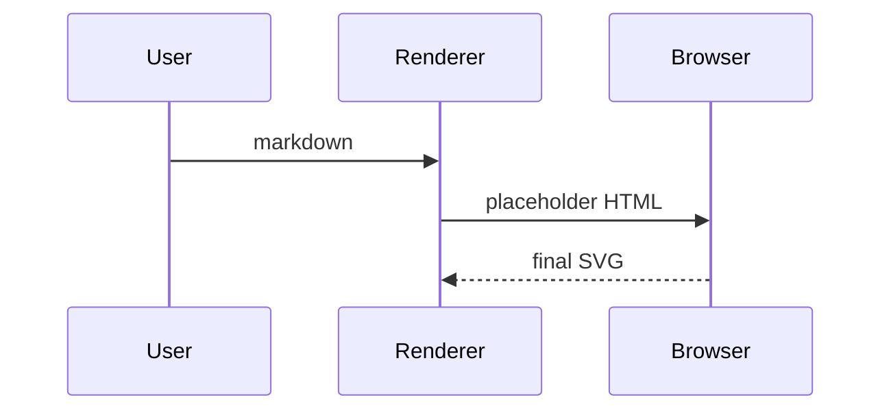
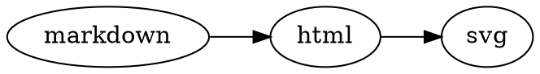

# Extended Markdown Demo

This example is for humans using the skill, not for internal tests.

- [x] CommonMark and GFM
- [x] Mermaid
- [x] KaTeX math
- [x] Trusted inline SVG
- [x] DOT / Graphviz

Inline math: $a^2 + b^2 = c^2$.

$$
\sum_{n=1}^{10} n = 55
$$

<svg viewBox="0 0 64 32" role="img" aria-label="Example SVG badge">
  <rect width="64" height="32" rx="8" fill="#0f172a"></rect>
  <text x="32" y="21" text-anchor="middle" fill="#fff">SVG</text>
</svg>

