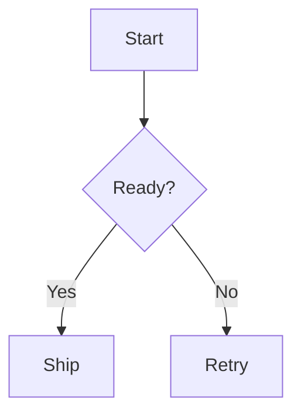

# Markdown Renderer Demo

This document exercises **standard markdown** and GFM features.

- [x] Task list item
- [ ] Pending task item

<details>
  <summary>Expandable note</summary>

  Hidden _markdown_ content.
</details>

Here is a footnote reference.[^1]

Inline math: $E = mc^2$.

$$
\int_0^1 x^2 dx = \frac{1}{3}
$$

```diff
- old branch
+ new branch
```



<svg viewBox="0 0 48 48" role="img" aria-label="Trusted example SVG">
  <circle cx="24" cy="24" r="18" fill="#0f172a"></circle>
  <text x="24" y="29" text-anchor="middle" fill="#ffffff">SVG</text>
</svg>


[^1]: Footnotes should survive the pipeline.
