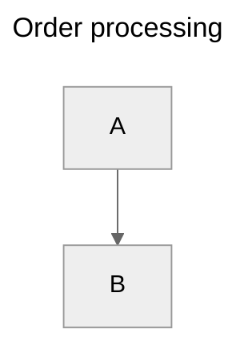

# Mermaid Syntax Cheatsheet

Sources: Mermaid.js official docs v11.x (mermaid.js.org), mermaid-js/mermaid
source (`packages/mermaid/src/diagrams/*`), Mermaid Live Editor examples.

Covers: per-diagram declarations, node and edge syntax, labels, subgraphs,
styling. One section per supported diagram type. Use this as a lookup, not
a tutorial — paste a working snippet, then edit.

## Document-level structure

Every diagram is plain text. The first non-empty, non-comment line must be a
**diagram declaration** (e.g. `flowchart TD`). Comments start with `%%`.

Optional YAML frontmatter wraps the whole diagram and configures theme,
title, and per-diagram options. It is the **only** allowed prefix to the
declaration:



## Flowchart

```
flowchart TD          %% direction: TB | TD | BT | RL | LR
```

Directions: `TB` (top→bottom, alias `TD`), `BT`, `RL`, `LR`.

### Nodes (shapes by bracket type)

| Shape          | Syntax                          |
| -------------- | ------------------------------- |
| Default (rect) | `id[Label]`                     |
| Round edges    | `id(Label)`                     |
| Stadium        | `id([Label])`                   |
| Subroutine     | `id[[Label]]`                   |
| Cylinder (DB)  | `id[(Label)]`                   |
| Circle         | `id((Label))`                   |
| Asymmetric     | `id>Label]`                     |
| Rhombus        | `id{Label}`                     |
| Hexagon        | `id{{Label}}`                   |
| Parallelogram  | `id[/Label/]` or `id[\Label\]`  |
| Trapezoid      | `id[/Label\]` or `id[\Label/]`  |
| Double circle  | `id(((Label)))`                 |

### Edges

| Edge                 | Syntax            |
| -------------------- | ----------------- |
| Arrow                | `A --> B`         |
| Open line            | `A --- B`         |
| Dotted arrow         | `A -.-> B`        |
| Thick arrow          | `A ==> B`         |
| Invisible            | `A ~~~ B`         |
| With label           | `A -->|label| B`  |
| With label (alt)     | `A -- label --> B`|
| Multi-directional    | `A <--> B`        |
| Cross-end            | `A --x B`         |
| Circle-end           | `A --o B`         |

### Subgraphs

```
subgraph title [Optional display label]
  A --> B
end
```

`direction LR` inside a subgraph sets its own direction.

### Styling

```
classDef warning fill:#f96,stroke:#333,stroke-width:2px;
class A,B warning;
style C fill:#0f0;
linkStyle 0 stroke:#f00,stroke-width:2px;
```

## Sequence Diagram

```
sequenceDiagram
  participant A as Alice
  participant B as Bob
  A->>B: Hello Bob
  B-->>A: Hello Alice
```

### Arrows (sequence-specific!)

| Arrow   | Meaning                  |
| ------- | ------------------------ |
| `->`    | Solid line, no arrow     |
| `-->`   | Dotted line, no arrow    |
| `->>`   | Solid line + arrowhead   |
| `-->>`  | Dotted line + arrowhead  |
| `-x`    | Solid + cross (lost msg) |
| `--x`   | Dotted + cross           |
| `-)`    | Async open arrow         |
| `--)`   | Dotted async open arrow  |

### Blocks

```
loop Every minute
  A->>B: Ping
end

alt is sick
  B->>A: Go home
else is well
  B->>A: Keep working
end

opt Extra info
  A->>B: FYI
end

par Parallel work
  A->>B: Task 1
and
  A->>C: Task 2
end

critical Establish connection
  A->>B: SYN
option Network failure
  A->>A: Retry
end

break When error
  A->>B: Abort
end

rect rgb(200, 220, 240)
  A->>B: Highlighted region
end
```

### Notes & activations

```
Note left of A: Aside
Note right of B: Aside
Note over A,B: Spanning note

activate B
B->>A: Reply
deactivate B
```

`autonumber` at the top adds step numbers.

## Class Diagram

```
classDiagram
  class Animal {
    +String name
    +int age
    +speak() void
  }
  class Dog
  Animal <|-- Dog
  Dog : +bark() void
```

### Relationships

| Syntax     | Meaning           |
| ---------- | ----------------- |
| `<|--`     | Inheritance       |
| `*--`      | Composition       |
| `o--`      | Aggregation       |
| `-->`      | Association       |
| `--`       | Link (solid)      |
| `..>`      | Dependency        |
| `..|>`     | Realization       |
| `..`       | Link (dashed)     |

Cardinality: `Customer "1" --> "*" Order : places`.

Members: `+` public, `-` private, `#` protected, `~` package, `$` static,
`*` abstract. Append `() ReturnType` for methods.

## State Diagram (v2)

Always use `stateDiagram-v2` — the legacy `stateDiagram` is deprecated.

```
stateDiagram-v2
  [*] --> Still
  Still --> Moving : start
  Moving --> Still : stop
  Moving --> Crash : collide
  Crash --> [*]
```

### Composite states & concurrency

```
state Active {
  [*] --> NumLockOff
  NumLockOff --> NumLockOn : EvNumLockPressed
  NumLockOn --> NumLockOff : EvNumLockPressed
  --
  [*] --> CapsLockOff
}
```

`--` is the concurrent region separator.

### Choice / Fork / Join

```
state if_state <<choice>>
state fork_state <<fork>>
state join_state <<join>>
```

Notes: `note right of State : Text`.

## Entity-Relationship Diagram

```
erDiagram
  CUSTOMER ||--o{ ORDER : places
  ORDER ||--|{ LINE-ITEM : contains
  CUSTOMER {
    string name
    string email
    int    age PK
  }
```

### Cardinality (left chars — right chars)

| Left  | Right  | Meaning              |
| ----- | ------ | -------------------- |
| `|o`  | `o|`   | Zero or one          |
| `||`  | `||`   | Exactly one          |
| `}o`  | `o{`   | Zero or many         |
| `}|`  | `|{`   | One or many          |

Line: solid `--` (identifying) or dashed `..` (non-identifying).

Attribute markers: `PK`, `FK`, `UK`. Comment: `"text"` after type.

## Gantt

```
gantt
  title Project plan
  dateFormat YYYY-MM-DD
  axisFormat %b %d
  section Backend
  Design       :a1, 2025-01-01, 7d
  Implement    :after a1, 14d
  section Frontend
  Wireframes   :crit, 2025-01-03, 5d
  Build        :active, 2025-01-10, 10d
```

Task states: `done`, `active`, `crit`, `milestone`. ID syntax: `task-id, start, length-or-end`.

## Pie

```
pie title Browser share
  "Chrome" : 64
  "Safari" : 19
  "Firefox" : 3
```

`showData` after `pie` to display values.

## Mindmap

```
mindmap
  root((Center))
    Branch A
      Leaf 1
      Leaf 2
    Branch B
      Leaf 3
```

Indentation defines hierarchy. Node shapes: `((cloud))`, `[square]`,
`(rounded)`, `))bang((`, `{{hex}}`.

## GitGraph

```
gitGraph
  commit
  branch develop
  checkout develop
  commit
  checkout main
  merge develop
```

Commit types: `commit type: NORMAL | REVERSE | HIGHLIGHT`, with optional
`id: "..."` and `tag: "..."`.

## User Journey

```
journey
  title My day
  section Morning
    Wake up: 3: Me
    Coffee: 5: Me, Cat
  section Work
    Standup: 2: Me, Team
```

Format: `Task: score: Actor1, Actor2`. Score is 1–5.

## Quadrant Chart

```
quadrantChart
  title Reach vs engagement
  x-axis Low Reach --> High Reach
  y-axis Low Engagement --> High Engagement
  quadrant-1 Champions
  quadrant-2 Crowd-pleasers
  quadrant-3 Niche
  quadrant-4 Misses
  Campaign A: [0.3, 0.6]
  Campaign B: [0.7, 0.8]
```

## Timeline

```
timeline
  title History of X
  2010 : Founded
  2015 : Series A
       : Office opens
  2020 : IPO
```

`section <name>` groups consecutive years.

## Sankey (beta)

```
sankey-beta

Agricultural,Bio-conversion,124.729
Bio-conversion,Liquid,0.597
Bio-conversion,Losses,26.862
```

CSV format: `source,target,value`. Blank line required between header and data.

## XY Chart (beta)

```
xychart-beta
  title "Monthly revenue"
  x-axis [Jan, Feb, Mar, Apr, May]
  y-axis "Revenue (k)" 0 --> 100
  bar [50, 60, 75, 80, 90]
  line [50, 60, 75, 80, 90]
```

## Block (beta)

```
block-beta
  columns 3
  a b c
  d:2 e
```

`columns N` sets layout. `id:N` spans N columns.

## C4 Diagram

```
C4Context
  title System Context for X
  Person(customer, "Customer")
  System(banking, "Banking System")
  Rel(customer, banking, "Uses")
```

Variants: `C4Container`, `C4Component`, `C4Dynamic`, `C4Deployment`.

## Architecture (beta)

```
architecture-beta
  group api(cloud)[API]
  service db(database)[Database] in api
  service server(server)[Server] in api
  db:L -- R:server
```

Icon keys: `cloud`, `database`, `server`, `disk`, `internet`. Edges use
compass connectors `:L`, `:R`, `:T`, `:B`.

## Frontmatter & config

Per-diagram config:

```
---
title: Diagram title
config:
  theme: base | default | dark | forest | neutral
  flowchart:
    curve: linear | basis | cardinal
    htmlLabels: true
  sequence:
    showSequenceNumbers: true
---
```

Inline directives (legacy, still supported): `%%{init: {"theme": "dark"}}%%`
on the line **before** the declaration.
